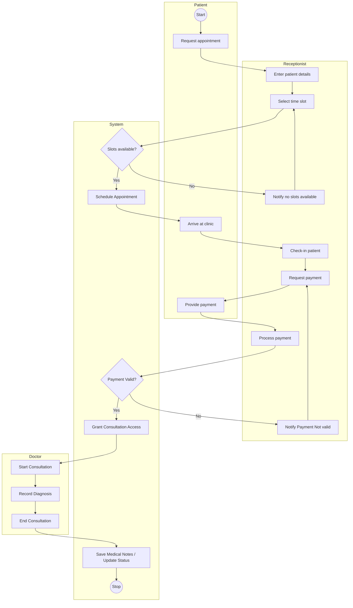

```mermaid
flowchart TD
    subgraph Patient
        start1((Start)) --> req_app[Request appointment]
        arrive[Arrive at clinic]
        pay[Provide payment]
    end

    subgraph Receptionist
        enter_details[Enter patient details]
        select_slot[Select time slot]
        notify_full[Notify no slots available]
        check_in[Check-in patient]
        req_pay[Request payment]
        proc_pay[Process payment]
        notify_payment[Notify Payment Not valid]
    end

    subgraph System
        check_avail{Slots available?}
        sched_app[Schedule Appointment]
        val_pay{Payment Valid?}
        grant_acc[Grant Consultation Access]
        save_notes[Save Medical Notes / Update Status]
        stop1((Stop))
    end
    
    subgraph Doctor
        start_cons[Start Consultation]
        rec_diag[Record Diagnosis]
        end_cons[End Consultation]
    end

    %% Scheduling Flow
    req_app --> enter_details
    enter_details --> select_slot
    select_slot --> check_avail

    check_avail -- "No" --> notify_full
    notify_full --> select_slot
    
    check_avail -- "Yes" --> sched_app

    %% Arrival and Payment Flow
    sched_app --> arrive
    arrive --> check_in
    check_in --> req_pay
    req_pay --> pay
    pay --> proc_pay
    proc_pay --> val_pay
    
    %% Consultation Flow
    val_pay -- "No" --> notify_payment
    notify_payment --> req_pay
    val_pay -- "Yes" --> grant_acc
    grant_acc --> start_cons

    start_cons --> rec_diag
    rec_diag --> end_cons
    end_cons --> save_notes
    save_notes --> stop1
```
